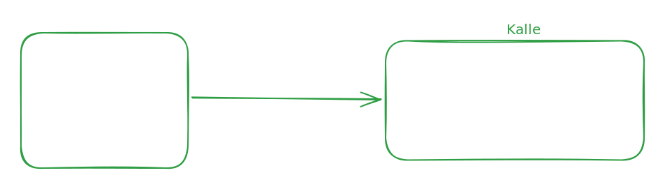

# Webdriver server

There is a need to be able to render arbitrary html (with javascript) to an image. For example all graphs that are included in a Word report; word cannot read the graphs as html and javascript but they can be inserted as images.

A new paragraph.

The WebDriver protocol makes it possible to 'remote' control a web browser instance. With a WebDriver it is possible to load html, execute javascript, render an element to a png image, among other things.

Each web browser vendor implement their own WebDriver. A WebDriver is essentially a program with an built in http server and clients communicates with it through a rest API. Starting a WebDriver is very expensive in terms of time; the exe must be started and get ready to receive requests, a session (ie. a browser instance) must be created and configured, an initial document (a stub) must be loaded, etc. The setup work takes seconds while loading and rendering the actual html takes milliseconds.

Since the actual unique work (render the html) per request is so small compared to the setup work it makes sense to save and reuse created WebDriver instances in a pool.

The memory consumption per WebDriver instance is pretty large (\~450mb) so the pool cannot be too large, but even a small amount of pooled instances makes a big difference for the throughput.

## The pool

The pool is implemented as a powershell module (`WebdriverServer.psm1`) that has a http server and clients communicate with it through a simple rest api. A client that needs to render some html connects to the pool server and requests a web driver instance. It passes the stub it wishes to use and receives back some info about the WebDriver instance. The client then uses this info to connect directly to the WebDriver instance, uses it and then returns it to the pool.

The server communicates with its client via a `HttpListener`. A thread (`ThreadJob` running `ListenerLoop`) is dedicated to sort the incoming requests into seperate queues per request type while the main thread proccesses the queues (inside `Start-WDPServer`).

There are three different types of requests: leases, releases and messages. Leases and releases are for requesting and returning WebDriver instances and messages are for everything else. For example, there is an `exit` message for shutting down the pool.

The pool consists of two lists, one for free instances and another for leased instances. Instances are created on demand.

When a client requests a WebDriver instance it passes a stub document it wishes to use. The pool will hash the stub and see if there is a free instance with a matching stub. If it cannot find one it will see if the pool is full and if it is not it will create a new instance. If the pool is full but there are free drivers, with different stubs, it will take one of those and reset the stub to the new one.

The current implementation assumes Firefox and its web driver `geckodriver.exe`:

* `$webdriverPath` points to `geckodriver.exe`.
* `WebDriverNewSession` requires the `browserName` capability to be `Firefox` and passes the Firefox specific object `mox:firefoxOptions`.
* Only tested against Firefox/geckodriver.

### Maintenance

A maintenance routine is performed once every 10 minutes. The routine validates that all web driver instances in the pool have not crashed or ended up in a unknown state.

The routine will check that:

* A free or leased web driver process has not exited.
* A leased web driver instance has not been abandoned by its user (the lease time has expired).
* A free web driver instance responds properly to the web driver status api request.
* The backing browser instance of a free web driver instance has not crashed, by executing a simple javascript.

## Module reference

### Enter-WDPDriverLease

Leases a web driver from the pool. Thin wrapper around the `lease` pool API, see below.

### Exit-WDPDriverLease

Releases a web driver instance back to the pool. Thin wrapper around the `release` pool API, see under `Pool API reference`

### Get-WDPStatus

Returns status information about the pool. Thin wrapper around the `message/status` pool API, see under `Pool API reference`.

### Stop-WDPServer

Stops the pool and kills all running web driver instances on the machine (not only those executed by the pool). The pool is stopped by sending the `message/exit` pool API request, see under `Pool API reference`.

### Start-WDPServer

Creates and starts the pool. This cmdlet will not return until the pool has been stopped. The pool will be listening for requests on `http://127.0.0.1:9090`.

#### **Parameters**

* `poolSize` \
  The size of the pool. Valid values are 1 through 20. Default is 4.
*   `logLevel` \
    The minimum log level that should get logged. Can be one of:

    * `[LogLevel]::Debug`
    * `[LogLevel]::Info`
    * `[LogLevel]::Warn`
    * `[LogLevel]::Error`

    Default is `[LogLevel]::Info`.
* `logFile`\
  The log file path. If this i snot specified the logs will be written to the host.

## Pool API reference

The base url of the pool is: `http://localhost:9090` The form of an request is: `http://localhost:9090/(name)[/more]`

Parameters are passed in the url or in the body (formatted as json). Return values are sent in the body (formatted as json).

If an error occurs while processing a request the response status code will be set to 500 and the body will contain a json object with a `error` property containing the error message and a `stackTrace` property containing the script stack trace as an array.

### Lease

`/lease` (post)

Leases a web driver instance. The web driver must be returned with `release`. If it is not properly returned it will expire automatically after 5 minutes. Note that this should be avoided as it adds pressure to the pool since the web driver instance will be deleted and not returned to the pool for reuse.

If a web driver instance is not available and the pool is full the call will wait for a web driver to become free for at most 60 seconds before failing with a 503 (service unavailable) status code.

#### **Parameters**

* `Stub`\
  The initial document that the WebDriver instance should be loaded with.

#### **Returns**

* `baseUrl`\
  The base url to the WebDriver instance.
* `sessionId`\
  The session id of the WebDriver instance. Used for further communication with the WebDriver instance.
* `id`\
  The id of the WebDriver instance. Used for returning the web driver instance to the pool with `release`.

### Release

`/release/(id)` (post)

Releases a web driver instance back to the pool.

#### **Parameters**

* `id` (in url path)\
  The id of the WebDriver instance to be released, obtained from a call to `lease`.

#### **Returns**

* `result`\
  A boolean indicating if the WebDriver instance was released successfully.

### Exit message

`/message/exit` (post)

Instructs the pool to shutdown. The pool will _not_ cleanup any remaining WebDriver instances.

#### **Parameters**

* None

#### **Returns**

* `result`\
  A boolean with the value `true`.

### Ping message

`/message/ping` (get)

A loopback message that responds immediately. Used for testing.

#### **Parameters**

* None

#### **Returns**

* `result`\
  A string with the value `pong`.

### Status message

`/message/status` (get)

Returns info about the contents of the pool.

#### **Parameters**

* None

#### **Returns**

* `LastActivity`\
  A timestamp for when a web driver was last leased or released.
* `LastMaintenance`\
  A timestamp for when maintenance was last performed.
* `MaxCount`\
  The maximum amount of drivers the pool can contain.
* `TotalMemoryUsageMb`\
  The total amount of memory, in megaby that all web drivers and their backing browser instances use (`Process.PrivateMemorySize64`).
* `FreeDriverCount`\
  The amount of currently free drivers in the pool.
* `LeasedDriverCount`\
  The amount of currently leased drivers in the pool.
* `LeasedDrivers`\
  An array of all leased drivers.
* `FreeDrivers`\
  An array of all free drivers.

## References

Gecko WebDriver \
[https://firefox-source-docs.mozilla.org/testing/geckodriver/index.html](https://firefox-source-docs.mozilla.org/testing/geckodriver/index.html) [https://github.com/mozilla/geckodriver/releases](https://github.com/mozilla/geckodriver/releases)

Simplified specification of the WebDriver protocol\
[https://github.com/jlipps/simple-wd-spec](https://github.com/jlipps/simple-wd-spec)

W3C WebDriver specification\
[https://www.w3.org/TR/webdriver1](https://www.w3.org/TR/webdriver1)
